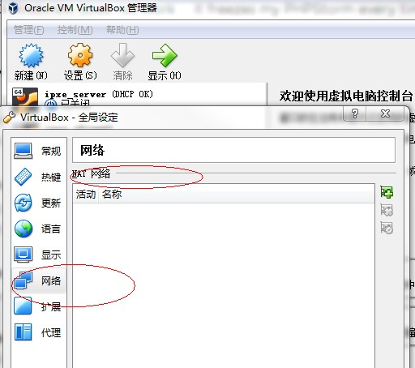
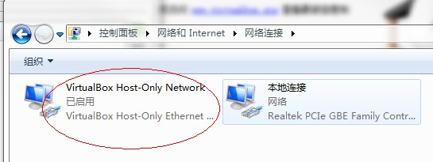
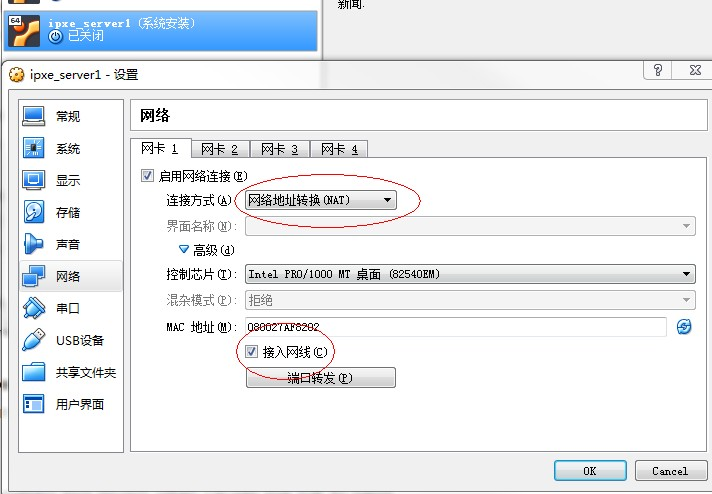
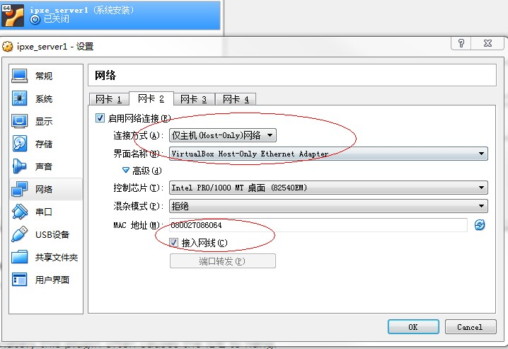
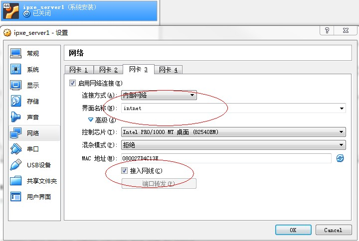
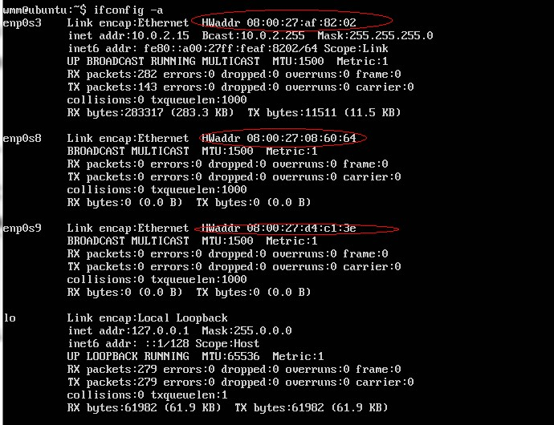
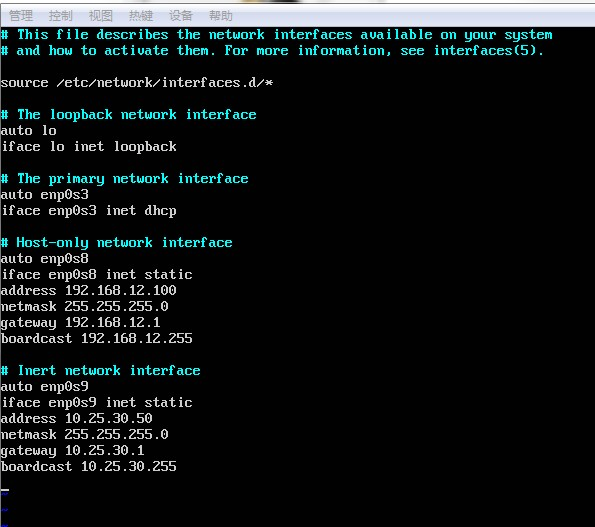
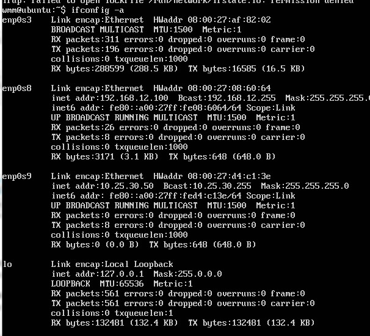
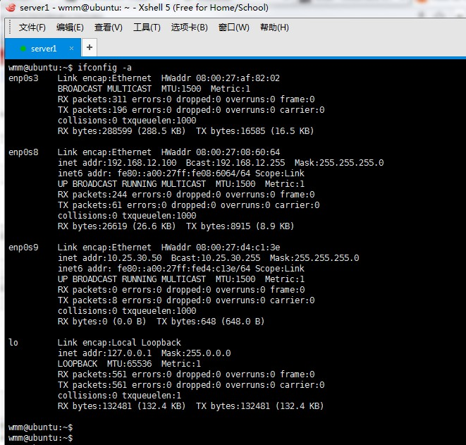
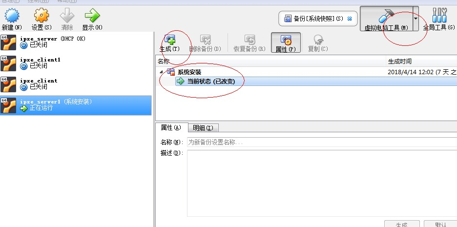

# IPXE网路安装实验
在vritualbox上用ubuntu server搭建ipxe网络安装环境进行ipxe测试Linux网络安装，了解IPXE网络安装过程和相应调试手段

1.安装Ubuntu server用于安装ipxe的server服务器(DHCP、TFTP、HTTP)

2.在Ubuntu server上安装DHCP、TFTP、HTTP服务器

3.通过ipxe流程进行网络安装，分析安装过程和Linux启动过程

4.Linux安装包定制

平台：
   - window7 联网PC
   - Virtual Box虚拟环境
   - Ubuntu server16.04安装包
## 1、安装Ubuntu Server和配置网卡
在Windows 7上安装virtualbox软件很简单，略过。
安装好Virtualbox后新建一个ipxe_server虚拟机，通过光盘安装Ubuntu server
- 在virtual box上创建全局only-host网卡(Ctrl+g)

    

    *在老一点的virtualbox版本上有only-host的网卡创建的，新版本的virtualbox删掉了这个配置，安装virtualbox的时候提示会安装这个网卡*
    安装完后会在系统的适配器中多出一个host-only的网卡,因为我们是用内网测试而且为了方便ssh链接使用静态ip，所以host-only网卡的dhcp开不开
    都无所谓

    
    - 配置Ipxe_server的网卡：一个NAT网卡用于联网下载更新系统软件，一个OnlyHost用于ssh链接，一个内部网络用于server和client的内部链接

    
    
    

    安装完Ubuntu server后，第一次开机对网络进行配置使得服务器可以联网和使用ssh登录
- 使用`ifconfig -a`命令查看当前所有网卡

    
    可以看到，在没有对配置文件进行修改时，只有NAT的网卡和lo的网卡有ip,启动lo是系统内环的网卡，暂时不用理会，后面也不用修改
    *这里可以看到网卡名称是enp0s~而不是eth~,这是Ubuntu新版本的网络命名规则改变，如果想改回eth~可以参考[这里]()*

- 使用vim命令修改interface`文件
    
    ```commandline
    sudo vim /etc/network/interface
    ```
    为了ssh方便host-only使用静态ip，而作为服务器端的server在内网当然也是使用静态ip，所以我们将host-only和内网都配置成静态ip
    
    
    
    使用`sudo ifdown -a --exclude=lo && ifup -a --exclude=lo`命令将除了lo之外的网卡都重启，为什么用这个命令而不用`sudo server 
    networking restart`命令，可以参考[这里](https://askubuntu.com/questions/230698/how-to-restart-the-networking-service/376586#376586)
    用`ifconfig -a`命令重新查一网卡看配置是否成功
    
    
    
    将主机的host-only网卡也配置成静态ip，和server的host-only网卡配置成同一个网段（配好了ping一下,内网和主机是隔离的，
    即使ip是同一网段也是ping不通的）就可以使用ssh登录了。
    
    
    
*备份是一个良好的习惯，安装好系统配置好网卡后可以先做一个系统备份*


## 2、安装DHCP 服务器
配置好网卡后server就可以通过NAT使用主机的网卡进行上网，使用`sudo apt update`和`sudo apt upgrade`更新软件后开始就可以安装DHCPf服务器了
先查看当前系统有没有安装有DHCP server(有些版本的Linux系统会默认安装),敲`server`后`tab`补全看看有没有`isc-dhcp-server`即可
确认没有安装后使用`apt install`命令进行安装
```commandline

```

## 3、问题及解决
1. 无法更新软件
    - [软件源](https://www.linuxidc.com/Linux/2013-05/83902.htm)
    - [Err:1 InRelease Temporary failure resolving 'security.ubuntu.com'](https://stackoverflow.com/questions/48023238/apt-get-commands-doesnt-work-in-docker-containers)
    - [Err:1 InRelease Temporary failure resolving 'security.ubuntu.com'](https://www.cnblogs.com/yunhua-521/p/7117547.html)