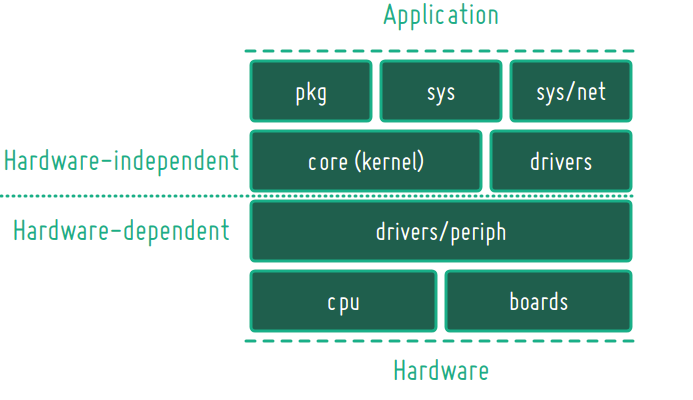

RIOT OS 
=================
RIOT是一个基于专为物联网设计的开源操作系统。系统内存要求非常低(大约几K即可)，系统实时、高效，支持无线和有线网络通信协议栈和低功耗。

RIOT提供微内核、多个网络协议栈和实用例程，包括加密库、数据结构(过滤器、哈希表、优先级队列)、shell等。

RIOT支持多种微控制器架构、无线驱动器、传感器和平台。支持C和C++编程，具有多线程、IPC、系统定时器、互斥锁等。


## 环境配置
- git
- 编译器
- `VirtualBox`虚拟机和`VirtualBox Extension Pack`
- `Vagrant`
- 下载代码
    ```
    git clone git://github.com/RIOT-OS/RIOT.git 
    cd RIOT
    git checkout <LATEST_RELEASE>
    ./dist/tools/tapsetup/tapsetup  # create virtual Ethernet
                                    # interfaces to connect multiple
                                    # RIOT instances
    cd examples/default/
    make all 
    make term
    ```
## 目录结构
 - core    

    内核代码，包涵啊调度器，进程通信，线程，线程同步以及支持的数据结构类型和定义组成

- boards

    平台支持包含两个逻辑元素：`cpu`和`boards`。`cpu`和`boards`为1：n关系。`boards`包含

    `/boards`包含其CPU的特定配置(主要包括外设和引脚映射、板载设配配置以及CPU时钟配置)和与板连接所需的一些脚本和配置文件(位于`boards/dist`目录中，这些配置脚本通常时自定义flash、调试脚本或OpenOCD配置文件)。

- cpu
    
    `/cpu`包含所有`cpu`的特定配置，如电源管理(LPM)、中断处理和向量、启动代码、时钟初始化代码和线程处理(如上下文切换)。在`/cpu/periph`和`/periph`中包含了`cpu`的外设驱动程序。`cpu`共享外设代码在对应的`/xxx_common`文件夹中。

- driver

    在外设驱动之上的设备驱动。如网络接口、传感器和执行器。驱动程序与平台无关，基于外设驱动公共接口实现(所有同类外设都有相同名称的API)。

- sys 
    内核模块。这些模块不属于硬件抽象和设备驱动程序。包含诸如数据结构、加密库、高级API、内存管理、shell等。

- pkg 
    RIOT支持的第三方软件包。
    
## 问题与答案
- [fatal error: bits/libc-header-start.h: 没有那个文件或目录](https://bugs.launchpad.net/ubuntu/+source/xen/+bug/1725390)